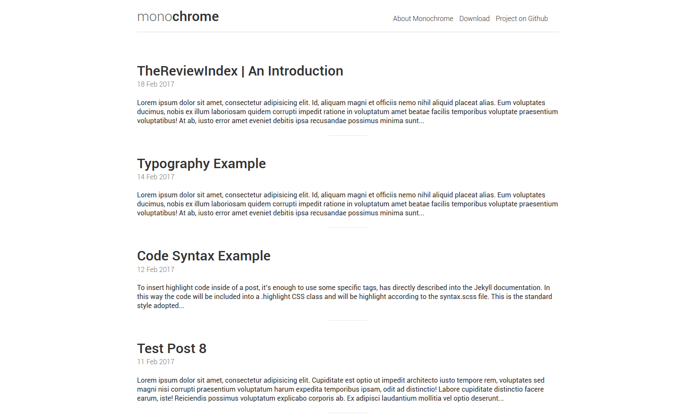

## About

Monochrome is a minimal, responsive theme created for Jekyll. The goal of Monochrome is to provide a ready to use, plug and play theme for those who want to set up a blog, and focus solely on the content.

## Features

- Completely responsive and mobile first
- Clean SEO friendly URLs, auto-generated from post title (no messy dates in the url)
- SEO title/description integration
- Sitemap ready
- Easy customization for header, footer, navigation links, colors, favicon etc
- Default Monochrome Color Palette - black, white, greys

### Setup

Monochrome may be installed by simply downloading the .zip folder from the [repository on Github](https://github.com/thereviewindex/monochrome/archive/master.zip).

After extracting the content from the folder into the selected directory, you can type `jekyll serve` from the terminal, than open your browser to `0.0.0.0:4000/monochrome/` and you will find it there.

Additionally it is possible to fork the repository and use Github Pages as hosting. By following this way it will be enough to change the `baseurl` value into the `_config.yml` file, with the directory name of your project (for example /blog) or simply with a "/" (slash) if you want install Monochrome in the root.

For further details on Monochrome, please visit the [repository on Github](https://github.com/thereviewindex/monochrome/).

